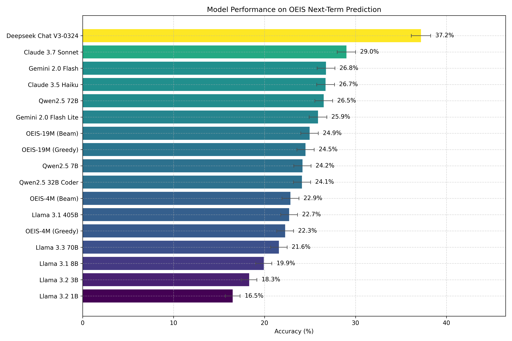
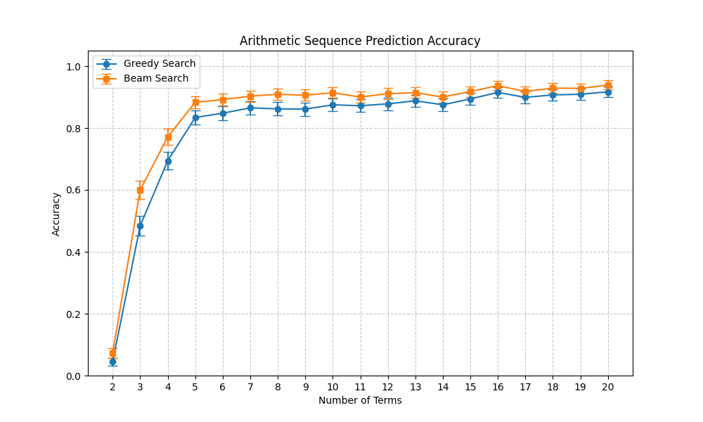

# OEIS LLM

**The following documentation is mostly Claudeslop. Read at your own risk.**

A benchmark and framework for evaluating and training models on OEIS (Online Encyclopedia of Integer Sequences) next-term prediction tasks.

## Overview

This project evaluates the ability of language models to predict the next term in integer sequences from the [Online Encyclopedia of Integer Sequences (OEIS)](https://oeis.org/). It includes:

1. Data processing tools for OEIS sequences
2. Training framework for small models using MLX
3. Benchmark tools for evaluating commercial and open-source models
4. Visualization utilities for results analysis

## Key Features

- **Training Framework**: Train small neural language models on OEIS sequences using MLX
- **Benchmark System**: Test various models and compare performance
- **Arithmetic Testing**: Specialized testing for arithmetic sequence completion
- **Leaderboard**: Track and visualize performance across different models

## Project Structure

### Data Processing

- `data_processing/`: Tools for loading, preprocessing, and preparing OEIS data
- `process_data.py`: Formats OEIS sequences for model consumption

### Model Training

- `train.py`: Core training functionality with configuration-based setup
- `sample.yaml`: Example configuration for model training
- `runs/`: Directory containing training runs, checkpoints, and logs

### Evaluation

- `generate.py`: Generation utility for trained models
- `generate_lite.py`: Lightweight generation tools with beam search support
- `test_arithmetic.py`: Test models on arithmetic sequence prediction
- `run_arithmetic_tests.py`: Run test suites and plot results
- `test_model.js`: JavaScript-based testing for external API models

### Visualization

- `plot-leaderboard.py`: Generate performance comparison charts
- `plot-logs.py`: Visualize training metrics
- `graphs/`: Output directory for generated visualizations

## Performance Leaderboard

Current model performance on the OEIS next-term prediction benchmark:



## Beam Search vs Greedy Decoding

Comparison of beam search versus greedy decoding performance on arithmetic sequence prediction tasks:



The graph demonstrates how beam search consistently outperforms greedy decoding as the number of terms increases, providing more accurate predictions for complex sequences.

## Getting Started

### Prerequisites

- Python 3.8+
- MLX (Apple Silicon optimized)
- Node.js (for API testing)

### Installation

1. Clone the repository
2. Install Python dependencies (using `pip install -r requirements.txt`)
3. Install Node.js dependencies with `npm install`

### Training a Model

```bash
python train.py --config sample.yaml
```

### Evaluating Models

```bash
# Test a custom model
python test_arithmetic.py --run OEIS-4M

# Generate sequences
python generate.py --run OEIS-4M --prompt "1,2,3,4,5,"

# Run arithmetic test suite
python run_arithmetic_tests.py
```

### Checkpoints

Checkpoints of the OEIS-4M and OEIS-19M are included, along with their respective training logs. You can find them in the `runs/` directory.

### Testing Commercial Models

Modify `index.js` with your API key and run:

```bash
npm run start
```

## License

CC0 (Public Domain)